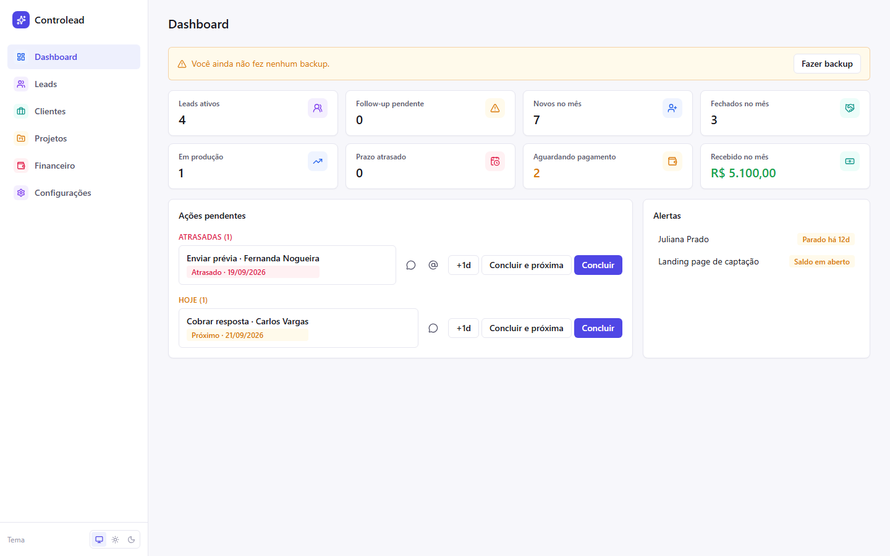
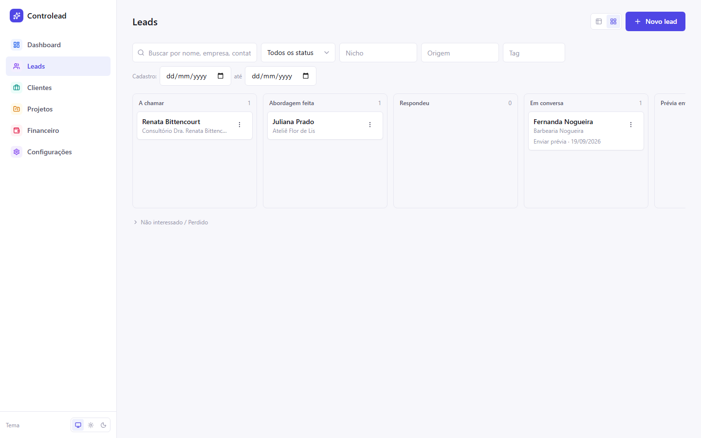
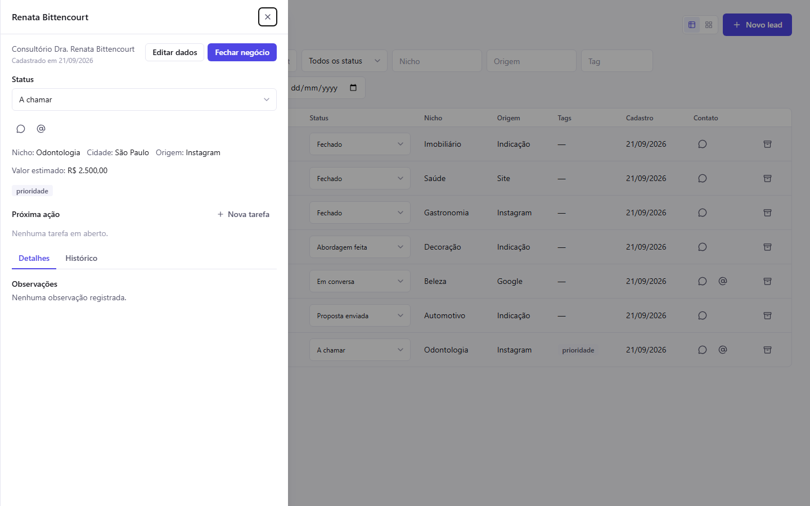
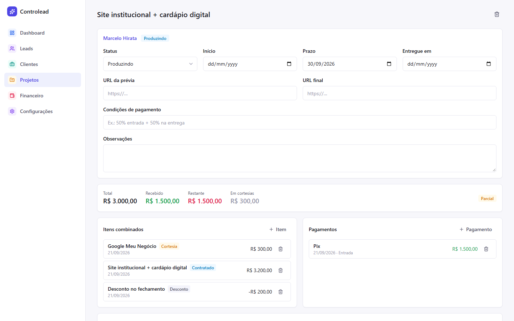
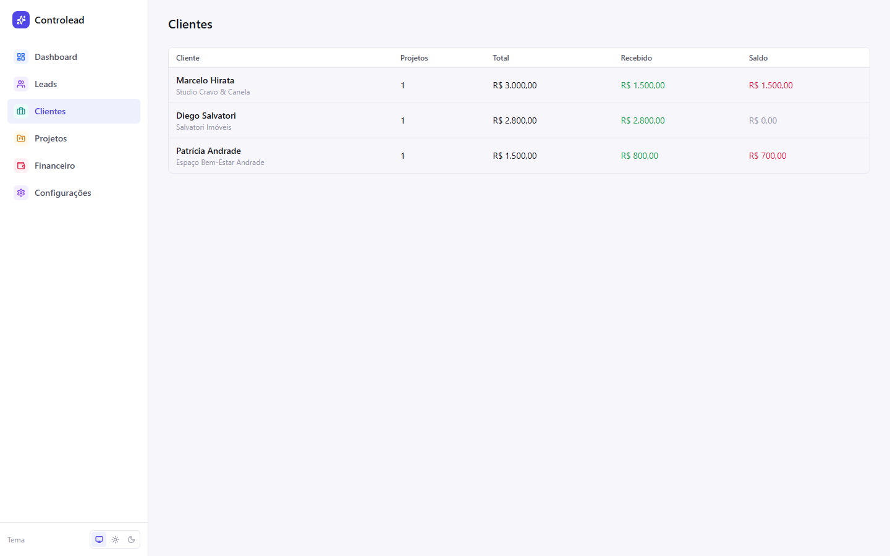
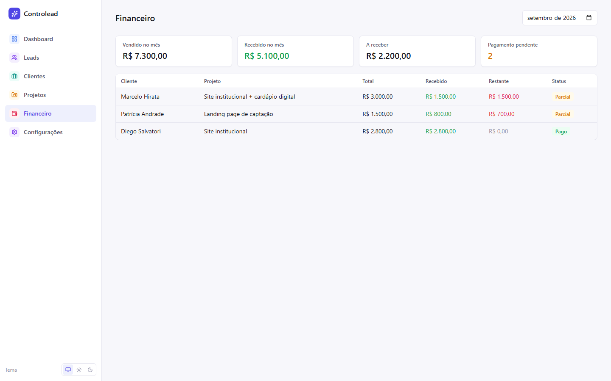

# Controlead

**CRM pessoal + gerenciador de projetos** para quem faz prospecção e entrega de sites e serviços por conta própria.

Centraliza o fluxo **Lead → abordagem → follow-up → fechamento → produção → entrega → pagamento** numa única aplicação **100% local**: sem login, sem conta, sem backend remoto e sem depender de internet. Todos os dados ficam no seu computador.



---

## Índice

- [Por que existe](#por-que-existe)
- [Funcionalidades](#funcionalidades)
- [Screenshots](#screenshots)
- [Como usar](#como-usar)
- [Rodando o projeto localmente](#rodando-o-projeto-localmente)
- [App desktop (.exe)](#app-desktop-exe)
- [Backup e restauração](#backup-e-restauração)
- [Arquitetura e stack](#arquitetura-e-stack)
- [Estrutura de pastas](#estrutura-de-pastas)
- [Modelo de dados](#modelo-de-dados-resumo)
- [Como contribuir](#como-contribuir)
- [Roadmap](#roadmap)

---

## Por que existe

Quem presta serviço sozinho (freelancer, pequena agência, prestador autônomo) geralmente controla leads numa planilha, follow-ups na memória e pagamentos em anotações soltas. O Controlead junta as três coisas num só lugar, sem a complexidade de um CRM corporativo:

- **Sem cadastro, sem login.** Abre e já está pronto para usar.
- **Seus dados nunca saem do seu computador.** Tudo fica no IndexedDB do navegador (ou do app desktop).
- **Foco em ação, não em gráfico.** O Dashboard mostra o que precisa ser feito hoje, não métricas decorativas.

## Funcionalidades

### 📋 Leads (pipeline comercial)
- Cadastro rápido (só o nome é obrigatório) com Instagram, WhatsApp, site, nicho, cidade, origem, valor estimado e tags.
- Pipeline configurável: A chamar → Abordagem feita → Respondeu → Em conversa → Prévia enviada → Proposta enviada → Fechado, com Não interessado/Perdido como estados finais.
- **Duas visões**: tabela (com edição de status inline) e **Kanban** com drag-and-drop nativo.
- Aviso automático de possível lead duplicado (mesmo Instagram/WhatsApp).
- Atalhos de um clique para abrir WhatsApp, Instagram e site.

### 🕒 Próxima ação e follow-up
- Cada lead tem uma "próxima ação" (fazer abordagem, follow-up, enviar prévia/proposta, cobrar resposta...) com data.
- **Sugestão automática de follow-up**: ao mudar o status do lead, o app sugere (não cria sozinho) uma data de follow-up, configurável por status em Configurações.
- Concluir uma ação já oferece cadastrar a próxima na hora ("concluir e próxima").
- Alerta de **lead parado** (sem interação há N dias e sem próxima ação agendada).

### 📝 Histórico
- Timeline automática por lead e por projeto: mudanças de status, contatos registrados, pagamentos, itens adicionados, fechamento de negócio.
- Notas manuais a qualquer momento (não contam como "interação" — só contato de verdade reseta o alerta de lead parado).

### 🤝 Fechar negócio
- Um clique no Drawer do lead (ou soltar o card na coluna "Fechado" do Kanban) abre o modal de fechamento.
- Preenche serviço, valor original, desconto **ou** valor final (um recalcula o outro), entrada e forma de pagamento, prazo.
- Ao confirmar: cria o projeto, o item de preço, o pagamento da entrada, cancela as tarefas comerciais em aberto e registra tudo no histórico — numa única transação.

### 📁 Projetos
- Status de produção (A iniciar → Produzindo → Aguardando cliente → Ajustes → Finalizado → Entregue, mais Cancelado).
- **Itens combinados**: contratado, adicional, cortesia e desconto — o preço do projeto é sempre a soma desses itens, nunca um campo solto.
- **Pagamentos individuais** (não um campo único de "valor recebido"): cada pagamento tem valor, data, forma e observação.
- Resumo financeiro (total, recebido, restante, status) sempre **calculado**, nunca digitado à mão.

### 👥 Clientes
- Não existe cadastro de "Cliente" separado — é uma visão automática dos leads que já fecharam pelo menos um projeto, com total de projetos, valor total, recebido e saldo agregados.
- Fechar um segundo projeto para o mesmo lead é só clicar em "Novo projeto".

### 💰 Financeiro
- KPIs do mês (vendido, recebido, a receber, pagamentos pendentes) com seletor de mês.
- Tabela Cliente | Projeto | Total | Recebido | Restante | Status.

### 📊 Dashboard
- KPIs clicáveis (cada um leva direto à lista já filtrada correspondente).
- **Ações pendentes**: tarefas atrasadas, de hoje e dos próximos 7 dias, com atalho de contato e botões de concluir/adiar direto na lista.
- **Alertas**: projetos atrasados ou com prazo próximo, leads parados, projetos entregues com saldo em aberto.
- Lembrete de backup quando faz tempo que você não exporta seus dados.

### 🔎 Busca global
- `Ctrl+K` (ou `Cmd+K`) em qualquer tela abre uma busca instantânea por leads e projetos (nome, empresa, Instagram, WhatsApp, cidade, nicho, tags, serviço), sem acentuação nem caixa importarem.

### 💾 Backup
- Exporta um `.json` com tudo; importa de volta com validação completa (formato, integridade entre tabelas, versão de schema) antes de sobrescrever qualquer coisa. Um backup automático do estado atual é feito antes de qualquer importação.

### 🌗 Tema
- Segue o tema do sistema por padrão, com opção manual de claro/escuro.

---

## Screenshots

| Dashboard | Leads (Kanban) |
|---|---|
|  |  |

| Drawer do lead | Detalhe do projeto |
|---|---|
|  |  |

| Clientes | Financeiro |
|---|---|
|  |  |

---

## Como usar

1. **Cadastre um lead** em Leads → "Novo lead" (só o nome é obrigatório).
2. **Mova o pipeline**: mude o status pela tabela, pelo Drawer (clique no lead) ou arrastando o card no Kanban. Alguns status sugerem um follow-up automaticamente.
3. **Registre contatos e notas** no Drawer do lead, na aba Histórico.
4. **Feche o negócio** quando o lead topar: botão "Fechar negócio" no Drawer, ou solte o card na coluna "Fechado" do Kanban.
5. **Acompanhe o projeto** em Projetos: mude o status de produção, adicione itens (extras, cortesias, descontos) e registre pagamentos conforme chegam.
6. **Veja tudo agregado** por cliente em Clientes e por mês em Financeiro.
7. **Comece cada dia pelo Dashboard**: ele já mostra o que está atrasado, o que vence hoje e o que precisa de atenção.
8. **Exporte um backup** de vez em quando em Configurações — é a única cópia dos seus dados.

## Rodando o projeto localmente

Pré-requisitos: [Node.js](https://nodejs.org) 20+.

```bash
git clone https://github.com/adryan1-dev/controlead.git
cd controlead
npm install
npm run dev
```

Abre em [http://localhost:5183](http://localhost:5183).

| Comando | O que faz |
|---|---|
| `npm run dev` | Sobe o servidor de desenvolvimento (porta fixa 5183) |
| `npm run build` | Build de produção (checagem de tipos + Vite build) |
| `npm run preview` | Serve o build de produção localmente |
| `npm test` | Roda a suíte de testes (Vitest) |
| `npm run test:watch` | Testes em modo watch |
| `npm run dev:desktop` | Sobe o app como janela desktop (Tauri), em modo dev |
| `npm run build:desktop` | Gera o instalador desktop (`.exe`/`.msi`) |

### Por que a porta é fixa (5183)

Todos os dados do Controlead ficam no **IndexedDB do navegador**, que é isolado por *origem* (protocolo + host + porta). Se você rodar o app numa porta diferente, o navegador enxerga isso como um site completamente diferente — e os dados cadastrados "somem" (na verdade ficam presos na origem antiga). Por isso a porta está fixada em `vite.config.ts` (`server.port`/`preview.port` com `strictPort: true`). Não mude a porta sem antes exportar um backup.

## App desktop (.exe)

O Controlead pode ser empacotado como aplicativo desktop nativo via [Tauri](https://tauri.app), para instalar e compartilhar sem precisar rodar `npm run dev`.

```bash
npm run build:desktop
```

Pré-requisitos (só para *gerar* o instalador — quem só vai *usar* o app instalado não precisa de nada disso):

- [Rust](https://www.rust-lang.org/tools/install) (via `rustup`)
- No Windows: [Microsoft C++ Build Tools](https://visualstudio.microsoft.com/visual-cpp-build-tools/) (workload "Desenvolvimento para desktop com C++")

O instalador gerado (`.exe`/`.msi` em `src-tauri/target/release/bundle/`) instala uma versão **zerada** — cada instalação tem seu próprio armazenamento local, sem nenhum dado compartilhado entre máquinas diferentes.

## Backup e restauração

Como não existe servidor nem conta na nuvem, **o backup é a sua rede de segurança**. Em Configurações:

- **Exportar backup**: baixa um arquivo `controlead-backup-AAAA-MM-DD-HHmm.json` com todos os dados (leads, tarefas, histórico, projetos, itens, pagamentos e configurações).
- **Importar backup**: seleciona um arquivo exportado anteriormente. O app valida o arquivo (formato, versão de schema, integridade entre as tabelas) antes de qualquer alteração, mostra quantos registros existem hoje vs. no arquivo, e só substitui os dados atuais depois de você digitar "SUBSTITUIR" para confirmar. Um backup do estado atual é baixado automaticamente antes da substituição — uma importação nunca é uma via de mão única.

O Dashboard avisa quando faz muito tempo desde o último backup (prazo configurável em Configurações → Automações).

## Arquitetura e stack

- **React 19 + TypeScript + Vite** — SPA local, sem SSR.
- **Tailwind CSS v4** — tokens semânticos em `src/index.css`, dark mode automático (`prefers-color-scheme`) com override manual.
- **Dexie.js** sobre IndexedDB — persistência local, reativa via `dexie-react-hooks`.
- **React Router** — navegação e filtros refletidos na URL (sobrevivem a reload e são linkáveis).
- **Zod** — validação de formulários e do arquivo de backup.
- **Vitest** — testes de domínio (cálculos, regras) e de serviços (transações no Dexie via `fake-indexeddb`).
- **Tauri** (opcional) — empacotamento como app desktop nativo.

Nenhuma dependência de UI pesada (sem Redux, sem React Query, sem biblioteca de drag-and-drop): o app é propositalmente pequeno e direto.

## Estrutura de pastas

```
src/
  db/         Instância Dexie, schema versionado, storage.persist()
  domain/     Lógica pura: tipos, constantes, cálculos financeiros, regras de automação,
              validação (zod), migrações de schema — sem depender de UI nem de banco
  services/   Única camada que escreve no banco (leadService, projectService, dealService,
              taskService, paymentService, backupService, settingsService); cada escrita
              relevante já grava o evento correspondente no histórico
  hooks/      Hooks React (useLiveQuery) que leem do Dexie de forma reativa
  components/ UI reutilizável (ui/ = genéricos; shared/ = específicos do domínio; layout/)
  features/   Páginas e componentes de cada área (leads, projects, clients, finance,
              dashboard, deals, tasks, settings)
src-tauri/    Configuração do empacotamento desktop (Tauri)
```

## Modelo de dados (resumo)

- **Lead** é a única entidade de "pessoa/empresa" — não existe tabela de Cliente. Um lead vira "cliente" automaticamente quando ganha o primeiro **Project** (`/clients` é uma visão derivada, não uma tabela própria).
- **Project** guarda status, prazos e URLs. O preço não é um campo solto: é a soma dos **ProjectItem** (`contratado` + `adicional` − `desconto`; `cortesia` não entra no total).
- **Payment** são os pagamentos individuais; recebido/saldo/status financeiro são sempre calculados a partir deles (`domain/finance.ts`), nunca armazenados.
- **Task** é a "próxima ação" de um lead (ou de um projeto). **Event** é o histórico append-only, alimentado automaticamente pelos serviços a cada mudança relevante.

## Como contribuir

Contribuições são bem-vindas! O projeto é pequeno de propósito, então o pedido principal é: **mantenha a simplicidade**.

1. Dê um fork e crie uma branch a partir de `main`: `git checkout -b minha-melhoria`.
2. Rode `npm install` e `npm test` para confirmar que está tudo verde antes de começar.
3. Siga os padrões já existentes:
   - Regra de negócio nova → `src/domain/` (função pura) + teste em `*.test.ts`.
   - Nova escrita no banco → passa por um `services/*` (nunca escreva no Dexie direto de um componente), em `db.transaction(...)`, gravando o evento de histórico correspondente.
   - Componente de UI novo e genérico → `components/ui/`; específico de uma área → dentro de `features/<área>/`.
4. Rode `npm run build` e `npm test` antes de abrir o PR — ambos precisam passar.
5. Descreva no PR o que mudou e por quê. Prints ajudam bastante para mudanças visuais.

Issues e sugestões também são bem-vindas, mesmo sem código — principalmente relatos de fricção no fluxo do dia a dia (afinal esse é o objetivo do app).

## Roadmap

Ideias registradas para o futuro, propositalmente **não implementadas ainda** para não inchar o escopo:

- Templates de mensagem de abordagem/follow-up com botão de copiar.
- Métricas de conversão (taxa de resposta, taxa de fechamento, por origem/nicho, tempo médio lead→cliente).
- PWA e notificações locais para tarefas do dia.
- Importação de backup com mesclagem (hoje é só substituição total).
- Serviços recorrentes (hospedagem, manutenção mensal).

---

Feito para uso pessoal, sem pretensão de virar produto — mas se for útil para você também, fique à vontade.
